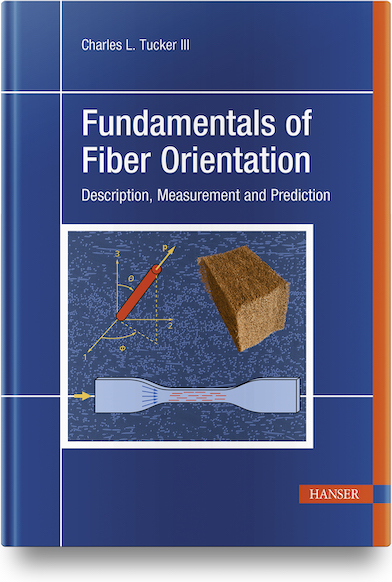

# Errata for _Fundamentals of Fiber Orientation_

By Charles L. Tucker III, Department of Mechanical Science and Engineering, University of Illinois at Urbana-Champaign

This repository lists errors and corrections for the book _Fundamentals of Fiber Orienation: Description, Measurement and Prediction_, C. L. Tucker, Hanser, Munich, 2022.
If you find errors in the book you can notify me by e-mail to ctucker@illinois.edu, and I will update the errata list.  

You can find the book at www.hanser-fachbuch.de.9781569908754 or on Amazaon at https://www.amazon.com/Fundamentals-Fiber-Orientation-Description-Measurement/dp/1569908753.

A set of Matlab functions to do many common calculations related to fiber orientation and mechanical property modeling is available at 
https://github.com/charlestucker3/Fiber-Orientation-Tools.  
